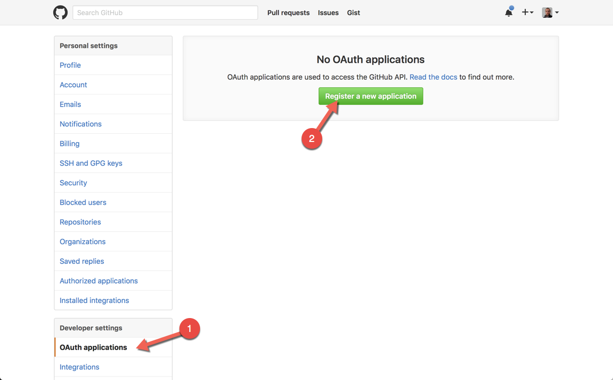
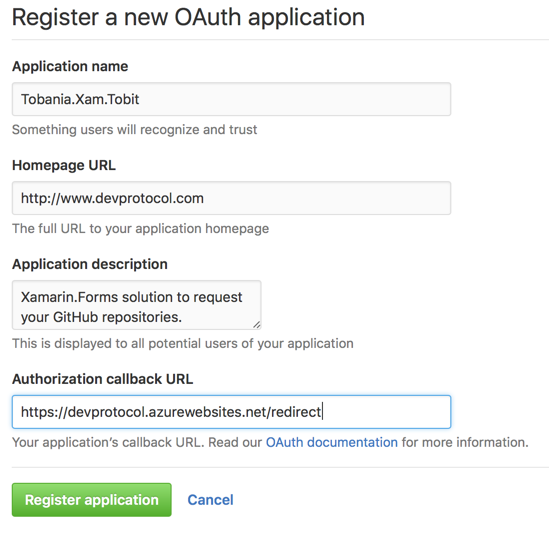
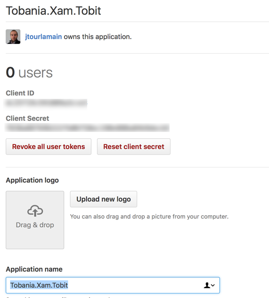

# Authorize your app within GitHub

## Overview

Nowadays almost all online services have an API. In this tutorial we'll make use of the GitHub API.
Before we can talk to the API we need to setup our account to allow an application to communicate with the API.

## Steps
- Login with your GitHub account
- Go to your settings

- Click on the "OAuth applications" in the "Developer settings" and "Register a new application"

- Fill out the form to get the ClientId and ClientSecret needed for authorization.

 

## GitHub API
Info about the GitHub API can be found on [https://developer.github.com/v3/](https://developer.github.com/v3/)
