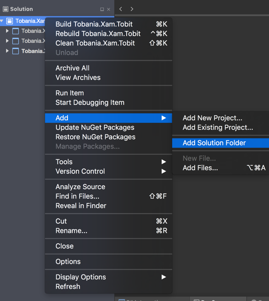

# Setup

## Solution

### Create Solution
Start by creating a new Xamarin.Forms solution "Tobania.Xam.Tobit". Make sure to use a proper namespace for your project. 
- VS chose Cross-Platform -> Blank Xaml App (Xamarin.Forms Portable)
- XS Multiplatform -> App -> Forms App. Use PCL

### Organize your project in solution folders
Start creating 2 solution folders: "Shared" and "Targets"



When creating Tests (automated UI tests or unit tests) you can create a thrid folder "Tests".
Move the iOS and Droid project to the "Targets" folder and the "Tobania.Xam.Tobit" project to the "Shared" folder.

### Add UI project
When you work with MVVM your View can know about your ViewModel, but your ViewModel may not know about your view. Sometimes it's very tempting to violate that principle.
By separating your UI from the other projects you'll be forced to respect that principle. Another advantage is you reduce the chance to have merge conflicts when another team is doing UI stuff.
- Right click on the Solution folder and add a new Portable Library "Tobania.Xam.Tobit.UI". Move the project into the "Shared" solution folder.
- If necassary add the Xamarin.Forms NuGet package to the UI project.
- Move the App.xaml and App.xaml.cs file from "Tobania.Xam.Tobit" to "Tobania.Xam.Tobit.UI"
- Make sure the namespaces in the App.xaml and App.xaml.cs file are correct
    - In App.xaml change x:Class="Tobania.Xam.Tobit.App" to x:Class="Tobania.Xam.Tobit.UI.App"
    - In App.xaml.cs change "namespace Tobania.Xam.Tobit" to "namespace Tobania.Xam.Tobit.UI"
- In Tobania.Xam.Tobit.UI add a reference to Tobania.xam.Tobit. That's ok to do because our views may know about the viewmodels (which will be placed in the Tobania.Xam.Tobit project).
- Add a reference to the Tobania.Xam.Tobit.UI project from the iOS project and the Droid project.
- Finally add a using statement "using Tobania.Xam.Tobit.UI;" in the AppDelegate.cs file in the iOS project and the MainActivity.cs file of the Doird project.

### Solution housekeeping
- Update the Xamarin.Forms NuGet packages to the latest version (currently 2.3.2.127)
- Verify the target frameworks on iOS and Android
    - Android minimum version level 21, target version 23
    - iOS (cf ino.plist file) deployment target 9.3

### Add a basic folder structure
- In the UI project Tobania.Xam.Tobit.UI add the following folders:
    - Cells
    - Converters
    - Pages
- In the Tobania.Xam.Tobit project add the following folders:
    - Config
    - Models
    - ServiceAgents
    - ViewModels
- In the iOS and Droid project add a folder:
    - Renderers

### Change your app name
If you build your Android app and run it, you'll notice that it didn't get the name "Tobit", but "Tobania.Xam.Tobit.Droid".
We want to change the application name throughout the application.
- in your android project add a new strings.xml file in Resources/values. Verify that the build action in the properties of the file is set to "AndroidResource".
- add the app name
```html
<?xml version="1.0" encoding="UTF-8" ?>
<resources>
  <string name="app_name">Tobit</string>
</resources>
```
- Open the MainActivity file and change the app name in the Activity attribute
```C#
[Activity(Label = "@string/app_name", ...
```
- In the properties of your android project set the Application name to "@string/app_name".

### Result
Your basic solution should now look like:


Make sure your solution builds before moving on.

## Repository
Before we push our basic solution to a Git repository, you first want to organize your repository.
- Create a folder "src" and move all your solution in that folder.
- Create a folder "docs" where you can keep additional documentation, markdown files,...
- Create a folder "AppStore" where you can keep you assets for the stores (like screenshots)
- Add a .gitignore file in the root of your repository. When working with an Android project your IDE recreates the Resource.Designer.cs file each time you build. When working in a team, your colleagues will always receive conflicts on that file because it's always different. You can add the file in the .gitignore file to avoid fustrated colleagues.


